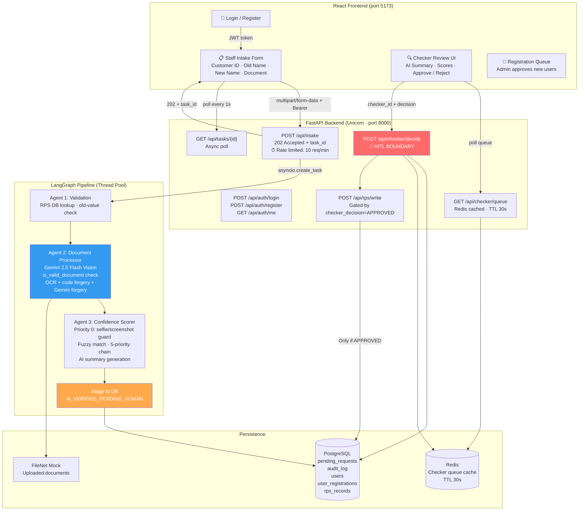

# Intelligent Account Servicing Workflow (IASW)

> **AI Product Engineer — Technical Assignment**
> End-to-end agentic AI system for automated bank account change verification with mandatory Human-in-the-Loop (HITL) Checker approval.

---

## 🏗 Architecture



> **Async boundary:** `POST /api/intake` returns `202 Accepted` instantly. The LangGraph pipeline runs in a background thread pool — the UI polls `GET /api/tasks/{id}` every second until `COMPLETED`.

---

## 🚀 Quick Start (Docker Compose — Recommended)

### Prerequisites
- Docker Desktop running
- A Gemini API key from [aistudio.google.com/app/apikey](https://aistudio.google.com/app/apikey)

### 1. Configure environment

```bash
cp .env.example .env
# Open .env and set:
#   GEMINI_API_KEY=your_actual_key
#   JWT_SECRET=any-long-random-string
```

### 2. Start the full stack

```bash
docker compose up -d
```

This starts 4 containers:

| Container | Purpose | Port |
|-----------|---------|------|
| `db` | PostgreSQL 15 | 5432 |
| `redis` | Redis 7 (cache) | 6379 |
| `backend` | FastAPI + LangGraph | 8000 |
| `frontend` | React + Vite (nginx) | 5173 |

### 3. Open the app

| URL | Description |
|-----|-------------|
| `http://localhost:5173` | Main application (Login → Intake / Checker) |
| `http://localhost:8000/docs` | Interactive Swagger API docs |
| `http://localhost:8000/health` | System health (LLM mode, cache status) |

### 4. Demo credentials (auto-seeded)

| Role | Username | Password | Can Do |
|------|----------|---------|--------|
| **Admin** | `admin` | `admin123` | Submit requests, view checker queue, approve/reject, manage registrations |
| **Staff User** | `user` | `user123` | Submit intake requests only |

---

## 🖥 Local Dev (Without Docker)

```bash
# Backend
python -m venv venv && source venv/bin/activate
pip install -r requirements.txt
uvicorn app.main:app --reload --port 8000

# Frontend (separate terminal)
cd frontend && npm install && npm run dev
```

> Uses SQLite locally (auto-created as `iasw.db`). No PostgreSQL or Redis needed.

---

## 📋 Demo Walkthrough

### End-to-End Legal Name Change Flow

**Step 1 — Login as Staff User**
- Open `http://localhost:5173`
- Login with `user / user123`

**Step 2 — Submit an Intake Request**
- Customer ID: `C001` (Priya Sharma)
- Change Type: `Legal Name Change`
- Current Name: `Priya Sharma`
- New Name: `Priya Mehta`
- Upload: A marriage certificate image
- Click **Submit** — system returns a Task ID immediately (`202 Accepted`)
- The UI polls the task status every second

**Step 3 — AI Pipeline runs (~5–10 seconds)**

```
Agent 1: Validation Agent
  ├─ Looks up C001 in rps_records table → name = "Priya Sharma" ✓
  └─ Matches submitted old_value → PASSED

Agent 2: Document Processor
  ├─ is_valid_document check: Is this actually a document? (not a selfie)
  ├─ Gemini 2.5 Flash Vision → extracts bride_name, married_name, issue_date
  ├─ Code-level forgery checks (magic bytes, EXIF, PDF metadata)
  └─ Gemini dedicated forgery analysis (tamper signal breakdown)

Agent 3: Confidence Scorer
  ├─ Priority 0: Selfie/screenshot guard (hard REJECT if not a document)
  ├─ Fuzzy name match (old + new, weakest-link scoring)
  ├─ Authenticity score (extraction confidence + forgery verdict)
  └─ Recommendation: APPROVE / FLAG / REJECT
```

**Step 4 — Login as Admin (Checker)**
- Logout → Login with `admin / admin123`
- Go to **Checker Queue**
- Review the AI summary, confidence scores, document type, forgery signals
- Click **Approve** or **Reject** with optional notes

**Step 5 — RPS Write (on Approval)**
- Only if Checker clicks Approve does `POST /api/rps/write` fire
- The `rps_records` table is updated with the new name
- An immutable audit log entry is written

---

## 🗄 Database Schema (5 Tables)

```sql
-- Core banking mock data
rps_records          (customer_id PK, name, dob, address, phone, email)

-- Change request lifecycle
pending_requests     (id PK, customer_id, change_type, old_value, new_value,
                      extracted_value, document_type, filenet_ref_id,
                      confidence_name, confidence_authenticity, forgery_check,
                      ai_summary, ai_recommendation, overall_status,
                      checker_id, checker_decision, checker_notes,
                      created_at, updated_at, decided_at)

-- Immutable audit trail
audit_log            (id PK, request_id FK, actor, action, detail JSON, created_at)

-- Authentication
users                (id PK, username UNIQUE, password_hash, role, active, created_at, approved_by)
user_registrations   (id PK, username UNIQUE, password_hash, requested_role,
                      status, decision_by, decision_at, decision_notes, created_at)
```

**View any table:**
```bash
docker compose exec db psql -U postgres -d iasw_db -c "SELECT * FROM rps_records;"
docker compose exec db psql -U postgres -d iasw_db -c "SELECT id, customer_id, overall_status, ai_recommendation FROM pending_requests;"
docker compose exec db psql -U postgres -d iasw_db -c "SELECT username, role, active FROM users;"
```

---

## 🤖 AI Stack

| Component | Technology | Purpose |
|-----------|-----------|---------|
| Orchestration | LangGraph | Stateful 3-node agent pipeline |
| Vision / OCR | Gemini 2.5 Flash | Document field extraction |
| Forgery (visual) | Gemini 2.5 Flash | Dedicated tamper signal analysis |
| Forgery (code) | Custom heuristics | Magic bytes, EXIF, PDF metadata |
| Name matching | FuzzyWuzzy | Token-sort-ratio, OCR-tolerant |
| Document guard | Gemini + rule | `is_valid_document` check (rejects selfies) |

---

## 🔐 Authentication & Roles

| Endpoint | Access |
|----------|--------|
| `POST /api/auth/login` | Public |
| `POST /api/auth/register` | Public (pending admin approval) |
| `GET /api/auth/me` | Any authenticated user |
| `GET /api/auth/registrations` | ADMIN only |
| `POST /api/checker/decide` | ADMIN only |
| `GET /api/checker/queue` | ADMIN only |
| `POST /api/intake` | Any authenticated USER |
| `POST /api/rps/write` | System (gated by checker_decision) |

---

## 🛡 HITL Boundary — 3 Layers

```
Layer 1: Graph    — No write node in LangGraph pipeline. AI cannot commit.
Layer 2: API      — POST /api/rps/write validates checker_id + APPROVED status.
Layer 3: Database — CHECK constraint: checker_id must be non-null for APPROVED rows.
```

---

## 📁 Project Structure

```
├── app/
│   ├── agents/
│   │   ├── graph.py              # LangGraph state machine
│   │   ├── validation_agent.py   # Agent 1: RPS cross-check (DB-backed)
│   │   ├── document_processor.py # Agent 2: Gemini OCR + forgery
│   │   └── confidence_scorer.py  # Agent 3: Scoring + recommendation
│   ├── routers/
│   │   ├── auth.py               # Login, register, user management
│   │   ├── intake.py             # Async intake (202 + task poll)
│   │   ├── checker.py            # HITL decision endpoint
│   │   └── rps.py                # RPS write (HITL gated)
│   ├── services/
│   │   ├── auth.py               # JWT, bcrypt, seed users
│   │   ├── cache.py              # Redis cache manager
│   │   ├── forgery_checks.py     # Code-level forgery heuristics
│   │   ├── async_tasks.py        # Background task manager
│   │   └── observability.py      # structlog JSON logging
│   ├── database.py               # SQLAlchemy models (5 tables)
│   ├── config.py                 # Centralised settings
│   └── main.py                   # FastAPI app + startup hooks
├── frontend/
│   └── src/
│       ├── auth/                 # AuthContext, ProtectedRoute
│       ├── pages/
│       │   ├── Login.jsx         # Login page
│       │   ├── Register.jsx      # Self-serve registration
│       │   ├── Intake.jsx        # Staff submission form
│       │   ├── Checker.jsx       # Admin review dashboard
│       │   └── Registrations.jsx # Admin registration queue
│       └── api.js                # Axios API client (JWT headers)
├── k8s/                          # Kubernetes manifests (GKE-ready)
├── docker-compose.yml            # Full stack (db + redis + backend + frontend)
├── Dockerfile                    # Backend production image
├── k8s/frontend.Dockerfile       # Frontend nginx production image
├── requirements.txt
├── .env.example                  # Template (copy to .env, never commit .env)
├── README.md                     # This file
├── DEPLOYMENT.md                 # Docker + Kubernetes deployment guide
└── SOLUTION_DESIGN.md            # Full technical submission document
```

---

## 🔧 Environment Variables

| Variable | Default | Description |
|----------|---------|-------------|
| `GEMINI_API_KEY` | (blank = mock mode) | Google AI Studio key |
| `GEMINI_MODEL` | `gemini-2.5-flash-preview-04-17` | Model for OCR + forgery |
| `GEMINI_STRICT` | `false` | Fail instead of falling back to mock |
| `DATABASE_URL` | `sqlite:///./iasw.db` | SQLite (local) or PostgreSQL (Docker) |
| `REDIS_URL` | `redis://localhost:6379/0` | Redis connection |
| `JWT_SECRET` | (unsafe default) | **Change in production** |
| `JWT_EXPIRE_MINUTES` | `60` | Token TTL |
| `SEED_ADMIN_USERNAME` | `admin` | Default admin username |
| `SEED_ADMIN_PASSWORD` | `admin123` | Default admin password |
| `SEED_USER_USERNAME` | `user` | Default user username |
| `SEED_USER_PASSWORD` | `user123` | Default user password |
| `APPROVE_THRESHOLD` | `0.80` | Auto-approve confidence threshold |
| `FLAG_THRESHOLD` | `0.60` | Human review threshold |
| `RATE_LIMIT` | `10/minute` | Intake rate limit per IP |

---

## 📜 Logs

| File | Contents |
|------|---------|
| `logs/iasw.log` | Structured JSON — all agent steps, API calls, errors |
| `logs/redis.log` | Cache hit/miss/invalidation events |

```bash
# Follow logs live:
docker compose logs backend -f

# Or tail the log file:
tail -f logs/iasw.log | python3 -m json.tool
```
