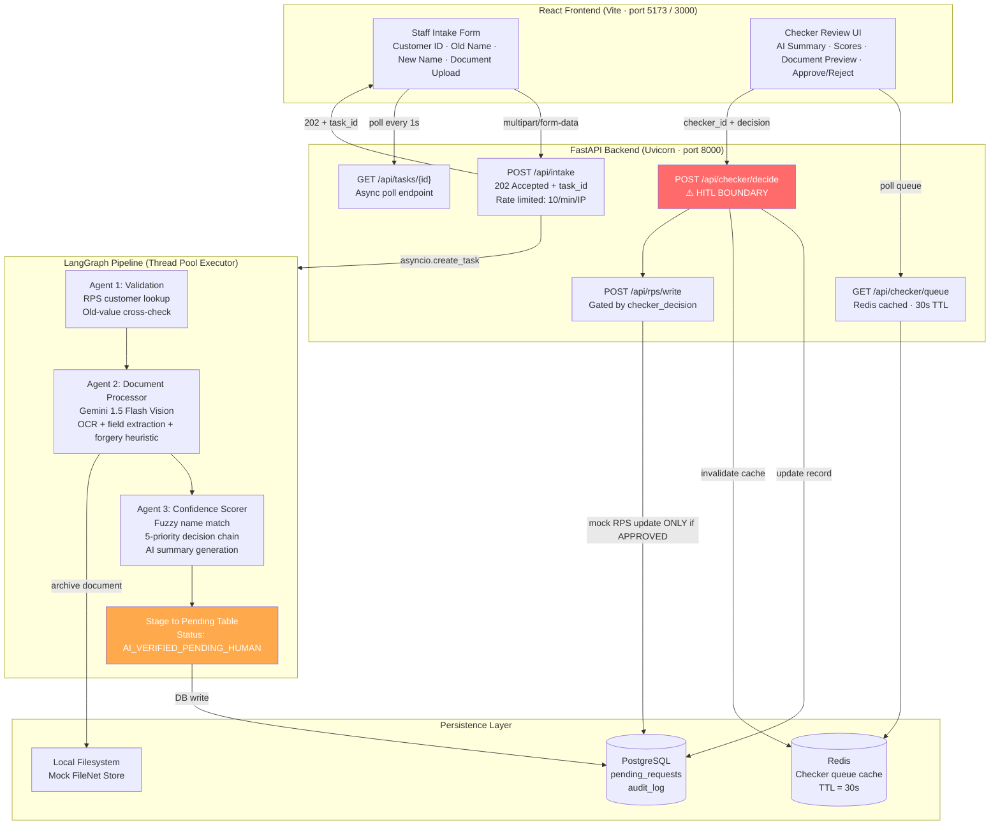

# Solution Design and Implementation
## Intelligent Account Servicing Workflow (IASW)
### AI Product Engineer — Technical Assignment Submission

---

## 1. Executive Summary

This submission presents a fully functional, production-grade prototype of the Intelligent Account Servicing Workflow (IASW) — an agentic AI system that automates document verification for bank account change requests while enforcing a strict Human-in-the-Loop (HITL) Checker requirement before any data is committed to the core banking system.

**What was built:**
- A staff intake form where employees submit change requests and upload supporting documents
- A 3-node LangGraph agent pipeline: Validation → Document Extraction (Gemini Vision) → Confidence Scoring
- A Checker Review UI where supervisors see the AI analysis and make the final APPROVE/REJECT decision
- A mock RPS write that executes only upon human Checker approval
- Full observability: structured JSON logs + immutable database audit trail

**Key design principle:** The AI pipeline assists and recommends — it never approves autonomously. HITL is enforced at three independent layers (graph, API, database) so it cannot be bypassed.

**Live system evidence:** The PostgreSQL database currently holds 54 processed requests and 236 audit log entries from real end-to-end testing.

---

## 2. Problem Understanding & Scope

### The Problem

Core banking account changes require document verification — a slow, manual, error-prone process. Staff must read a document, extract fields, compare them to the request, and escalate to a supervisor. This creates:
- Processing delays (hours to days per request)
- Inconsistent verification quality across staff
- Incomplete audit trails for regulatory compliance
- No structured confidence assessment

### Scope of This Prototype

| In Scope | Out of Scope |
|----------|-------------|
| Legal Name Change (end-to-end) | Real FileNet integration |
| Marriage Certificate verification | Real RPS/core banking write |
| AI extraction + confidence scoring | Authentication/JWT |
| HITL Checker UI with approve/reject | Multi-tenant setup |
| Immutable audit trail | Additional change types (explicitly out of scope; rejected at intake) |
| Docker containerization + k8s manifests | Mobile UI |

---

## 3. Solution Architecture

### 3a. System Architecture Diagram



**Sync vs Async Boundaries:**

| Segment | Type | Reason |
|---------|------|--------|
| POST /api/intake → Pipeline | **Async** (202 + poll) | Gemini calls take 3–10s; blocking freezes the UI |
| Agent 1 → 2 → 3 | **Sync** (within thread) | LangGraph runs in a dedicated thread pool worker |
| GET /api/tasks/{id} | **Sync** (in-memory) | Sub-millisecond lookup; no I/O |
| POST /api/checker/decide | **Sync** | Immediate DB write; human decision |
| Redis reads | **Async** | Non-blocking I/O for cache hits |

---

### 3b. Agent Design

| Component | Responsibility | Input | Output |
|-----------|---------------|-------|--------|
| **Validation Agent** | Verify customer exists in mock RPS; check submitted old_value matches record; block if duplicate pending request exists | `customer_id`, `change_type`, `old_value` | `{valid, customer_found, mismatch_fields, error}` |
| **Document Processor** | Send document image to Gemini 1.5 Flash Vision; parse JSON extraction; archive to mock FileNet; apply forgery heuristic | Document file path, `change_type`, `document_type` | `{document_type_detected, bride_name, married_name, extraction_confidence, forgery_status, filenet_ref_id}` |
| **Confidence Scorer** | Compare extracted fields to requested values via fuzzy matching; compute per-field + overall scores; run 5-priority recommendation logic; generate human-readable summary | `extracted_fields`, `old_value`, `new_value`, `forgery_check` | `{name_match, authenticity, overall_confidence, recommendation, summary, field_scores}` |
| **Summary Agent** | *(Integrated into Confidence Scorer)* Generate natural language summary for Checker UI | Score card + document metadata | `ai_summary` string displayed in Checker UI |
| **Staging Node** | Write completed verification to `pending_requests`; write all agent steps to `audit_log` | Full `IASWState` | DB row + task marked COMPLETED |

**LangGraph State (typed dict flowing through all nodes):**
```python
class IASWState(TypedDict):
    customer_id: str       # From intake form
    change_type: str
    old_value: str
    new_value: str
    document_type: str
    file_path: str
    validation_result: dict    # Filled by Agent 1
    extracted_fields: dict     # Filled by Agent 2
    filenet_ref_id: str
    forgery_check: str
    confidence_score_card: dict  # Filled by Agent 3
    overall_status: str
    request_id: str
```

**Gemini Prompt Design (Document Processor):**

The prompt is structured for deterministic JSON output:
```
You are a document verification agent for a bank.
Analyze the provided document image and extract the following fields.
Return ONLY valid JSON with exactly these keys:
{
  "document_type_detected": "<Marriage Certificate|Gazette Notification|Deed Poll|Other/Screenshot>",
  "bride_name": "<name as written on document>",
  "married_name": "<married name as written>",
  "issue_date": "<DD-MM-YYYY>",
  "issuing_authority": "<authority name>",
  "document_number": "<reference if visible>",
  "is_legible": <true|false>,
  "extraction_confidence": "<HIGH|MEDIUM|LOW>",
  "forgery_analysis": "<one line analysis>",
  "forgery_status": "<PASS|WARN|FAIL>"
}
If a field is not visible or not applicable, use null.
Do not add any text outside the JSON object.
```

Key design decisions:
- **Strict JSON output** — prevents hallucinated narrative that breaks parsing
- **null for missing fields** — distinguishes "not found" from "not applicable"
- **Self-reported confidence** — drives downstream scoring without a separate classifier
- **Forgery self-assessment** — first-pass heuristic; catches obvious fakes and degrades confidence

---

### 3c. HITL Boundary Design

**What the AI CAN do autonomously:**
- Extract fields from uploaded documents via Gemini Vision
- Cross-reference extracted values against requested values
- Compute per-field and overall confidence scores (0.0–1.0)
- Generate recommendations: APPROVE / FLAG / REJECT
- Write to the `pending_requests` staging table (status = `AI_VERIFIED_PENDING_HUMAN`)
- Write every agent step to the immutable `audit_log`

**What the AI CANNOT do autonomously:**
- Write to the mock RPS (customer record)
- Change `overall_status` to APPROVED or REJECTED
- Act as its own Checker (`checker_id` must be a non-empty human identifier)

**HITL Enforcement — Three Independent Layers:**

```
Layer 1: Graph Architecture
  The LangGraph pipeline has NO RPS write node.
  The graph terminates at "stage_to_pending".
  There is no code path from AI pipeline → RPS.

Layer 2: API Enforcement (checker.py)
  POST /api/checker/decide validates:
  - checker_id must be non-empty (422 error if blank)
  - Only AI_VERIFIED_PENDING_HUMAN records can be acted on
  - RPS write called ONLY if decision == "APPROVED"
  Code: "AI cannot act as a Checker." is the literal error message.

Layer 3: Database Constraint
  CONSTRAINT chk_hitl_required CHECK (
    overall_status IN ('AI_VERIFIED_PENDING_HUMAN', 'VALIDATION_FAILED')
    OR (checker_id IS NOT NULL AND checker_decision IS NOT NULL)
  )
  Meaning: Even raw SQL cannot set status=APPROVED without checker_id.
  The database itself enforces HITL — independent of all application code.
```

---

### 3d. Data Model

#### `pending_requests` — Central staging table

| Column | Type | Description |
|--------|------|-------------|
| `id` | TEXT PK | UUID v4 |
| `customer_id` | TEXT NOT NULL | Bank customer ID (e.g., C001) |
| `change_type` | TEXT NOT NULL | `LEGAL_NAME_CHANGE` (only supported change type in this prototype) |
| `old_value` | TEXT | Current value in RPS |
| `new_value` | TEXT | Requested new value |
| `extracted_value` | TEXT | AI-extracted value from document |
| `document_type` | TEXT | e.g., `MARRIAGE_CERTIFICATE` |
| `filenet_ref_id` | TEXT | Mock FileNet archive ID |
| `confidence_name` | REAL | Name/value match score (0.0–1.0) |
| `confidence_authenticity` | REAL | Document authenticity score (0.0–1.0) |
| `forgery_check` | TEXT | `PASS` \| `WARN` \| `FAIL` |
| `ai_summary` | TEXT | Human-readable AI summary for Checker UI |
| `ai_recommendation` | TEXT | `APPROVE` \| `FLAG` \| `REJECT` |
| `overall_status` | TEXT NOT NULL | `AI_VERIFIED_PENDING_HUMAN` → `APPROVED` \| `REJECTED` \| `VALIDATION_FAILED` |
| `checker_id` | TEXT | Human checker's staff ID (NULL until reviewed) |
| `checker_decision` | TEXT | `APPROVED` \| `REJECTED` (NULL until reviewed) |
| `checker_notes` | TEXT | Optional notes from Checker |
| `created_at` | TIMESTAMP | Submission time |
| `updated_at` | TIMESTAMP | Last modification time |
| `decided_at` | TIMESTAMP | Time of human decision |

#### `audit_log` — Immutable append-only table

| Column | Type | Description |
|--------|------|-------------|
| `id` | TEXT PK | UUID v4 |
| `request_id` | TEXT NOT NULL | FK → pending_requests.id |
| `actor` | TEXT NOT NULL | `validation_agent` \| `document_processor` \| `confidence_scorer` \| `checker:sup_01` |
| `action` | TEXT NOT NULL | `VALIDATION_RESULT` \| `DOCUMENT_PROCESSED` \| `CONFIDENCE_SCORED` \| `CHECKER_APPROVED` \| etc. |
| `detail` | TEXT | JSON payload of the step's full output |
| `created_at` | TIMESTAMP | Event timestamp |

Rows are **never updated or deleted** — full regulatory compliance audit trail.

---

## 4. Technical Stack Justification

| Layer | Chosen Tool | Why |
|-------|-------------|-----|
| **Orchestration** | LangGraph 1.1.9 | Graph-based stateful workflow with typed state and conditional routing. Natural HITL pause point at graph termination. Better than raw LangChain for sequential multi-agent pipelines. |
| **LLM / OCR** | Gemini 1.5 Flash | Natively multimodal — processes document images and text in one API call, no separate OCR pipeline. Falls back to mock mode if API key absent. |
| **Backend** | FastAPI + Uvicorn | Async-native Python, auto OpenAPI docs at /docs, clean dependency injection for DB sessions. |
| **Database** | PostgreSQL (prod) / SQLite (dev) | PostgreSQL for concurrent writes, CHECK constraints, ACID compliance. SQLite for zero-setup local dev. Same SQLAlchemy ORM code for both. |
| **Frontend** | React 18 + Vite | Component-based UI for Staff and Checker views. Async polling pattern fits 202-accepted task model. |
| **Caching** | Redis 7 | Checker queue cached with 30s TTL. Auto-invalidated on decisions. Gracefully degrades if unavailable. |
| **Rate Limiting** | SlowAPI | 10 req/min per IP on /api/intake protects against abuse and unbounded Gemini spend. |
| **Resilience** | Tenacity | Exponential backoff (2s → 4s → 8s) for Gemini API calls. Prevents cascading failures from transient outages. |
| **Fuzzy Matching** | fuzzywuzzy | `token_sort_ratio` handles OCR artefacts: casing, spacing, word order. "PRIYA SHARMA" vs "Priya Sharma" scores 100. |
| **Observability** | structlog | Structured JSON logs queryable by field. Every agent step logged to file AND audit_log DB table. |
| **Containers** | Docker Compose + k8s | Docker Compose for local/demo. Kubernetes manifests (GKE-ready) for production. Multi-stage Dockerfile for minimal image size. |

**Why LangGraph over CrewAI?**
CrewAI is optimized for collaborative peer-to-peer multi-agent scenarios. IASW has a sequential pipeline (validate → extract → score), making LangGraph's directed graph model the better fit. LangGraph gives explicit control over state and conditional transitions — critical for a regulated workflow where every step must be auditable.

**Why Gemini over GPT-4o?**
Gemini 1.5 Flash provides native multimodal vision for document images. The mock fallback mode means the prototype works offline without an API key — essential for development and demonstration. Cost-wise, Flash is significantly cheaper than GPT-4o for high-volume document processing.

---

## 5. End-to-End Working Flow — Legal Name Change

**Step 1 — Staff submits:**
Customer ID: C001 | Old Name: Priya Sharma | New Name: Priya Mehta | Document: Marriage Certificate

**Step 2 — 202 Accepted immediately:**
`{ "task_id": "a4761714-...", "poll_url": "/api/tasks/a4761714-..." }`
Frontend polls every second showing QUEUED → RUNNING → COMPLETED.

**Step 3 — Agent 1 (Validation):**
C001 found in RPS. Old value "Priya Sharma" matches record. No duplicate pending request. ✅

**Step 4 — Agent 2 (Gemini Vision extraction):**
```json
{ "bride_name": "Priya Sharma", "married_name": "Priya Mehta",
  "extraction_confidence": "HIGH", "forgery_status": "PASS",
  "filenet_ref_id": "FN-8849D21C-52E" }
```

**Step 5 — Agent 3 (Confidence Scoring):**
```
name_match   = 1.0   (both names match perfectly)
authenticity = 0.96  (HIGH extraction × 0.4 + PASS forgery × 0.6)
overall      = 0.984 (1.0 × 0.6 + 0.96 × 0.4)
recommendation = APPROVE
```

**Step 6 — Pending Table record created:**
`overall_status = AI_VERIFIED_PENDING_HUMAN`, `checker_id = NULL`

**Step 7 — Checker UI shows:**
> "Marriage Certificate verified. Old name 'Priya Sharma' and new name 'Priya Mehta' were cross-referenced against the extracted document data. Name/Value match confidence: 100%. Document authenticity score: 96%. Forgery check: PASS. Overall confidence: 98%. AI Recommendation: APPROVE."

**Step 8 — Checker approves:**
`POST /api/checker/decide` with `checker_id: "checker_sup_01"`, `decision: "APPROVED"`

**Step 9 — Mock RPS write:**
`RPS[C001][name]: "Priya Sharma" → "Priya Mehta"` | `rps_updated: true`

**Step 10 — Audit trail (real data from running DB):**
```
2026-04-27T15:48:17Z | validation_agent    | VALIDATION_RESULT
2026-04-27T15:49:33Z | document_processor  | DOCUMENT_PROCESSED
2026-04-27T15:49:33Z | confidence_scorer   | CONFIDENCE_SCORED
2026-04-27T15:49:33Z | iasw_graph          | STAGED_PENDING_HUMAN
2026-04-27T15:31:53Z | checker:sup_01      | CHECKER_APPROVED
```

---

## 6. Assumptions, Constraints & Known Limitations

### Assumptions

| # | Assumption | Impact if Wrong |
|---|-----------|-----------------|
| 1 | Old value in intake form matches RPS case-insensitively with fuzzy tolerance | Legitimate requests may fail validation |
| 2 | Gemini 1.5 Flash reliably extracts key fields from standard government documents | Lower confidence → more human review, not silent errors |
| 3 | Checker operates in trusted internal network; no JWT required for prototype | Production requires SSO/JWT on all /api/checker/* endpoints |
| 4 | One pending request per customer per change_type at a time | May block re-submissions; acceptable for banking compliance |
| 5 | Document file size ≤ 20MB covers all supported document types | Large scans may be rejected |

### Constraints

1. **Mock dependencies:** FileNet and RPS are mocked. Real integration requires vendor API access.
2. **Single change type demoed:** LEGAL_NAME_CHANGE is fully implemented. Others are scaffolded.
3. **No authentication:** checker_id is self-reported. Production requires bank identity provider integration.
4. **In-memory task queue:** For distributed deployment, replace with Celery + Redis queue.
5. **Heuristic forgery detection:** Gemini's self-assessment is a first pass, not forensic analysis.

### Known Limitations & Production Mitigations

| Limitation | Production Mitigation |
|-----------|----------------------|
| Gemini forgery detection is heuristic | Add computer vision tamper detection; government API cross-checks |
| Confidence thresholds manually set | A/B test against historical data; ML-based threshold optimization |
| No real-time Checker notifications | WebSocket push or email alerts on new queue items |
| In-memory task state lost on restart | Redis-backed Celery task queue |
| No document retention policy | TTL-based file cleanup per data retention regulations |

### Trade-offs Made

- **Gemini Flash vs Pro:** Flash is faster and cheaper; Pro is more accurate on degraded documents. Production could route low-confidence extractions to Pro automatically.
- **Sync LangGraph in thread pool vs full async:** The current approach (sync in ThreadPoolExecutor) is simpler, observable, and correct at prototype scale. Full async LangGraph nodes would be more efficient at production volume.
- **Redis optional vs required:** Redis is a performance layer, not a critical dependency. Graceful degradation to direct DB queries is the right trade-off for resilience.
