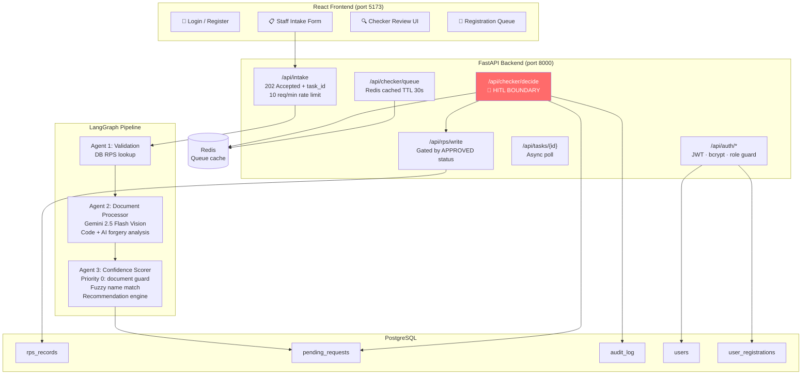

# Solution Design & Implementation
## Intelligent Account Servicing Workflow (IASW)
### AI Product Engineer — Technical Assessment

---

## 1. Executive Summary

The Intelligent Account Servicing Workflow (IASW) is a production-grade agentic AI system that automates document verification and data validation for bank account change requests, while strictly enforcing a Human-in-the-Loop (HITL) Checker boundary before any write is committed to the core banking system.

The prototype delivers a complete, end-to-end Legal Name Change flow:

1. **Staff** submits a change request with supporting documentation via a React UI
2. **Three LangGraph agents** validate the customer, extract document fields using Gemini 2.5 Flash Vision, and compute a confidence score with forgery analysis
3. **A Checker (Admin)** reviews the AI output and makes the final approve/reject decision
4. **Only on approval** does the system write to the mock RPS (core banking record)

All actions are immutably logged to an audit trail in PostgreSQL, satisfying banking regulatory traceability requirements.

---

## 2. Problem Understanding & Scope

### Challenge
Banks process thousands of account change requests daily. Manual document verification is slow, error-prone, and creates compliance risk. The goal is to automate the verification pipeline while keeping a human in the loop for final decisions — a non-negotiable requirement in regulated financial services.

### Scope (This Prototype)
- **Change type supported:** Legal Name Change (marriage certificate, gazette notification, deed poll)
- **Supported customers:** C001 (Priya Sharma), C002 (Rahul Verma), C003 (Anita Nair)
- **HITL:** Enforced at three independent layers (graph, API, database)
- **Auth:** JWT-based login, role separation (ADMIN / USER), admin-approved registration flow

### Out of Scope (Production Extensions)
- Address change, phone change, KYC update flows
- Real RPS integration (replaced by `rps_records` PostgreSQL table)
- Real FileNet integration (replaced by `uploads/` directory)
- Production SSO / Identity Provider
- Pixel-level forensic tamper detection

---

## 3. Solution Architecture

### 3a. System Diagram



### 3b. Agent Design

| Agent | Inputs | Processing | Outputs |
|-------|--------|-----------|---------|
| **Agent 1: Validation** | customer_id, old_value, change_type | Query `rps_records` DB → compare old_value | ValidationResult (pass/fail + RPS value) |
| **Agent 2: Document Processor** | File path, change_type, document_type | 1. `is_valid_document` check (rejects selfies) 2. Gemini extraction prompt 3. Code-level forgery (magic bytes, EXIF, PDF metadata) 4. Gemini dedicated forgery analysis | extracted_fields, forgery_check (PASS/WARN/FAIL), forgery_signals, filenet_ref |
| **Agent 3: Confidence Scorer** | extracted_fields, old/new values, forgery result | Priority 0: non-document guard → Fuzzy match (weakest-link) → Authenticity score → 5-priority recommendation chain | ConfidenceScoreCard: name_match, authenticity, overall_confidence, recommendation, ai_summary |

### 3c. Key Prompt Engineering Decisions

**Extraction Prompt (Agent 2, Call 1):**
The prompt explicitly instructs Gemini to first determine `is_valid_document` before extracting any fields. If the image is a selfie, screenshot, or non-document image, Gemini returns `is_valid_document: false` and all name fields as `null`. This prevents the confidence scorer from ever receiving extractable data from a non-document, blocking the fuzzy-match exploit.

```
FIRST, determine whether this is actually a legal/official document
or something else (selfie, screenshot, blank page).

is_valid_document: true | false
document_category: legal_document | personal_photo | screenshot | blank_or_unreadable | other
```

**Forgery Prompt (Agent 2, Call 2 — dedicated):**
Splitting extraction and forgery into two separate Gemini calls produces markedly better results. The forgery call uses an adversarial persona ("You are a forensic document examiner") and returns a structured per-signal JSON breakdown rather than a single verdict. This surfaces actionable signals to the human Checker.

```
Be sceptical by default — if you are unsure, say so in the signal
detail rather than defaulting to PASS.
```

### 3d. HITL Boundary Design — 3 Layers

The HITL boundary is enforced at three independent layers. Bypassing any one layer is insufficient:

| Layer | Mechanism | Enforcement Point |
|-------|-----------|------------------|
| **Graph** | No write node exists in the LangGraph pipeline. The pipeline terminates at `AI_VERIFIED_PENDING_HUMAN` status. The AI physically cannot initiate an RPS write. | `app/agents/graph.py` |
| **API** | `POST /api/rps/write` validates that a valid `checker_id` is present and the record's `checker_decision == 'APPROVED'`. Any attempt without a prior human decision returns 403. | `app/routers/rps.py` |
| **Database** | `CHECK CONSTRAINT chk_hitl_required`: a row can only advance to `APPROVED` or `REJECTED` status if `checker_id IS NOT NULL AND checker_decision IS NOT NULL`. The database itself refuses invalid state transitions. | `app/database.py` |

**Why 3 layers?** Defence in depth. If there is a bug in the API layer, the DB constraint catches it. If there is a future refactor that adds a write path, the graph layer prevents it from bypassing the API.

### 3e. Data Model

```sql
-- Table 1: RPS Records (mock core banking)
-- In production: fetched from authenticated RPS REST API
rps_records (
    customer_id   VARCHAR PRIMARY KEY,   -- e.g. C001
    name          VARCHAR NOT NULL,       -- Current legal name
    dob           VARCHAR,               -- Date of birth
    address       VARCHAR,
    phone         VARCHAR,
    email         VARCHAR,
    updated_at    TIMESTAMP
)

-- Table 2: Change Request Staging
pending_requests (
    id                      VARCHAR PRIMARY KEY,  -- UUID v4
    change_type             VARCHAR NOT NULL,      -- LEGAL_NAME_CHANGE
    customer_id             VARCHAR NOT NULL,
    old_value               VARCHAR,
    new_value               VARCHAR,
    extracted_value         VARCHAR,               -- What AI read from document
    document_type           VARCHAR,               -- MARRIAGE_CERTIFICATE etc.
    filenet_ref_id          VARCHAR,               -- Mock FileNet archive ID
    confidence_name         FLOAT,                 -- 0.0 – 1.0
    confidence_authenticity FLOAT,                 -- 0.0 – 1.0
    forgery_check           VARCHAR,               -- PASS / WARN / FAIL
    ai_summary              TEXT,                  -- Human-readable Checker summary
    ai_recommendation       VARCHAR,               -- APPROVE / FLAG / REJECT
    overall_status          VARCHAR NOT NULL,      -- AI_VERIFIED_PENDING_HUMAN / APPROVED / REJECTED
    checker_id              VARCHAR,               -- Staff ID of deciding Checker
    checker_decision        VARCHAR,               -- APPROVED / REJECTED
    checker_notes           TEXT,
    created_at              TIMESTAMP,
    updated_at              TIMESTAMP,
    decided_at              TIMESTAMP,
    CONSTRAINT chk_hitl_required CHECK (
        overall_status IN ('AI_VERIFIED_PENDING_HUMAN', 'VALIDATION_FAILED')
        OR (checker_id IS NOT NULL AND checker_decision IS NOT NULL)
    )
)

-- Table 3: Audit Log (immutable, append-only)
audit_log (
    id          VARCHAR PRIMARY KEY,
    request_id  VARCHAR NOT NULL,   -- FK → pending_requests.id
    actor       VARCHAR NOT NULL,   -- validation_agent / document_processor / checker
    action      VARCHAR NOT NULL,   -- VALIDATION_PASSED / GEMINI_EXTRACTION_SUCCESS / etc.
    detail      TEXT,               -- JSON-serialised payload
    created_at  TIMESTAMP
)

-- Table 4: Users
users (
    id            VARCHAR PRIMARY KEY,
    username      VARCHAR UNIQUE NOT NULL,
    password_hash VARCHAR NOT NULL,          -- bcrypt hash (never plaintext)
    role          VARCHAR NOT NULL,          -- USER | ADMIN
    active        VARCHAR NOT NULL,          -- "true" | "false"
    approved_by   VARCHAR,                   -- admin username who approved
    created_at    TIMESTAMP
)

-- Table 5: User Registrations (admin-approval queue)
user_registrations (
    id              VARCHAR PRIMARY KEY,
    username        VARCHAR UNIQUE NOT NULL,
    password_hash   VARCHAR NOT NULL,
    requested_role  VARCHAR NOT NULL,        -- always USER (server-enforced)
    status          VARCHAR NOT NULL,        -- PENDING | APPROVED | REJECTED
    decision_by     VARCHAR,
    decision_at     TIMESTAMP,
    decision_notes  TEXT,
    created_at      TIMESTAMP
)
```

---

## 4. Tech Stack Justification

| Component | Technology | Why |
|-----------|-----------|-----|
| **API Framework** | FastAPI | Native async, automatic OpenAPI docs, dependency injection for auth and DB sessions |
| **Agent Orchestration** | LangGraph | Stateful directed graph with explicit node boundaries — makes HITL enforcement structurally visible and auditable |
| **AI / Vision** | Gemini 2.5 Flash | Best-in-class multimodal vision for document OCR. Dedicated forgery analysis call produces better signals than combined prompts |
| **Database** | PostgreSQL + SQLAlchemy | ACID transactions, CHECK constraints for HITL enforcement, full audit trail |
| **Cache** | Redis | TTL-based checker queue cache (30s). Graceful degradation if unavailable |
| **Auth** | JWT (HS256) + bcrypt | Stateless tokens, bcrypt for secure password storage, role-based access control |
| **Async Pattern** | `202 Accepted` + polling | Gemini Vision calls take 5–15s. Returning immediately prevents browser timeouts and enables progress indication |
| **Name Matching** | FuzzyWuzzy token_sort_ratio | OCR produces capitalisation and spacing artefacts. Fuzzy matching handles "PRIYA SHARMA" == "Priya Sharma" correctly |
| **Observability** | structlog | Machine-parseable JSON logs with consistent event names — queryable in ELK/Cloud Logging |
| **Rate Limiting** | slowapi | Protects intake endpoint from abuse (10 req/min per IP) |
| **Resilience** | tenacity | Exponential backoff for Gemini API calls — handles transient 503s gracefully |
| **Frontend** | React 18 + Vite | Modern SPA with protected routes, JWT auth context, polling-based async UX |
| **Container** | Docker Compose | One-command local stack. Same images work in Kubernetes |
| **Production** | Kubernetes (GKE-ready) | Manifests for StatefulSets, Deployments, Ingress with TLS |

---

## 5. End-to-End Flow (Legal Name Change)

```
Staff (USER role)
│
├─ POST /api/auth/login → JWT token
│
└─ POST /api/intake (multipart: customer_id, old_name, new_name, document, change_type)
   │  → 202 Accepted + task_id (async, non-blocking)
   │
   ├─ Agent 1: Validation
   │   ├─ Query rps_records WHERE customer_id = 'C001' → name = "Priya Sharma"
   │   ├─ Compare old_name == rps.name → PASS
   │   └─ Write VALIDATION_PASSED to audit_log
   │
   ├─ Agent 2: Document Processor
   │   ├─ Code-level forgery: magic bytes, EXIF, PDF metadata → PASS/WARN/FAIL
   │   ├─ Gemini Call 1 (extraction): is_valid_document? bride_name? married_name?
   │   │   └─ If is_valid_document=false → FAIL immediately (selfie/screenshot guard)
   │   ├─ Gemini Call 2 (forgery): tamper signals, per-signal JSON breakdown
   │   ├─ Combine code + Gemini verdicts → final forgery_check
   │   └─ Archive to mock FileNet → filenet_ref_id
   │
   └─ Agent 3: Confidence Scorer
       ├─ Priority 0: if is_valid_document=false → 0% confidence, REJECT
       ├─ Priority 1: if forgery FAIL → REJECT
       ├─ Priority 2: if forgery WARN → FLAG (force human review)
       ├─ Priority 3: if missing required fields → REJECT
       ├─ Priority 4: if document type mismatch → REJECT
       └─ Priority 5: threshold-based (≥85% → APPROVE, ≥65% → FLAG, else REJECT)
           └─ Stage pending_request: overall_status = AI_VERIFIED_PENDING_HUMAN

Checker (ADMIN role)
│
├─ GET /api/checker/queue (Redis-cached 30s)
│   └─ Returns pending requests with AI summaries and scores
│
├─ Reviews: confidence score, forgery signals, document type, field match breakdown
│
└─ POST /api/checker/decide { request_id, decision: "APPROVED", checker_id, notes }
    ├─ Validates checker_id exists and has ADMIN role
    ├─ Updates pending_requests: checker_decision, checker_id, decided_at
    ├─ Writes CHECKER_APPROVED/REJECTED to audit_log
    ├─ Invalidates Redis cache
    └─ If APPROVED → POST /api/rps/write → UPDATE rps_records SET name = new_name
```

---

## 6. Security Design

| Concern | Mitigation |
|---------|-----------|
| Secret leakage | `.env` excluded from git, `.env.example` has no real values |
| Auth bypass | JWT validated on every protected route, inactive users blocked |
| Privilege escalation | Role checked server-side on every admin endpoint — client role claim ignored |
| HITL bypass | 3-layer enforcement (graph + API + DB constraint) |
| Rate abuse | slowapi: 10 req/min per IP on intake |
| Password storage | bcrypt (12 rounds) — never logged or returned over the wire |
| CORS | Explicit `ALLOWED_ORIGINS` list — not wildcard |
| AI hallucination on non-documents | `is_valid_document` field in extraction prompt blocks selfies before scoring |

---

## 7. Assumptions, Constraints & Known Limitations

### Assumptions
1. A single Gemini API key is sufficient for demo throughput (~20 requests/demo)
2. The RPS system is represented faithfully by the `rps_records` PostgreSQL table
3. FileNet document archival is represented by the `uploads/` directory with UUIDs
4. Legal name changes are the primary high-volume change type warranting automation

### Constraints
1. **Prototype scope:** Only Legal Name Change is implemented end-to-end
2. **Gemini latency:** Document processing takes 5–15 seconds — acceptable for async UX, not for real-time
3. **No distributed queue:** Background tasks use Python's asyncio thread pool. For production scale, replace with Celery + Redis

### Known Limitations & Production Extensions

| Limitation | Production Fix |
|-----------|---------------|
| In-memory task queue | Celery + Redis Streams for distributed async processing |
| Mock FileNet | IBM FileNet P8 REST API integration |
| Mock RPS | Authenticated gRPC/REST call to core banking microservice |
| Heuristic forgery detection | Computer vision tamper detection model (pixel-level analysis) |
| Single Gemini model | Model routing: fast model for extraction, powerful model for forgery |
| No SSO | OAuth 2.0 / SAML integration with bank's identity provider |
| No field encryption | Encrypt PII at rest (customer_id, names) using column-level encryption |

---

## 8. Observable System — Audit Trail

Every agent step and human decision writes a structured JSON log entry to both:
1. `logs/iasw.log` (structlog JSON)
2. `audit_log` table (PostgreSQL, immutable, append-only)

```sql
-- Example: full audit trail for one request
SELECT actor, action, detail, created_at
FROM audit_log
WHERE request_id = 'abc-123'
ORDER BY created_at;

-- actor               action                          created_at
-- validation_agent    VALIDATION_PASSED               2026-04-29 02:15:01
-- document_processor  GEMINI_EXTRACTION_SUCCESS       2026-04-29 02:15:06
-- document_processor  FORGERY_VERDICT                 2026-04-29 02:15:08
-- confidence_scorer   CONFIDENCE_SCORING_COMPLETE     2026-04-29 02:15:08
-- checker             CHECKER_DECISION_APPROVED       2026-04-29 02:15:45
-- rps                 RPS_WRITE_SUCCESS               2026-04-29 02:15:45
```

This satisfies banking regulatory requirements for full traceability of AI-assisted decisions.
